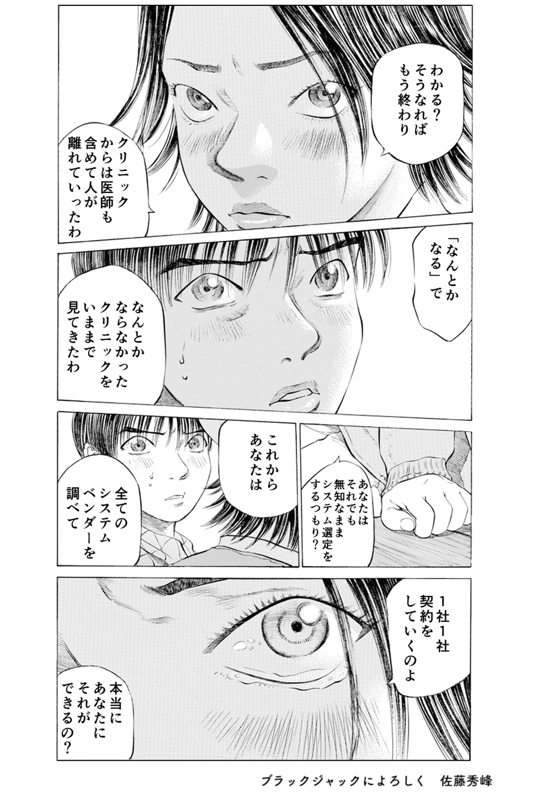
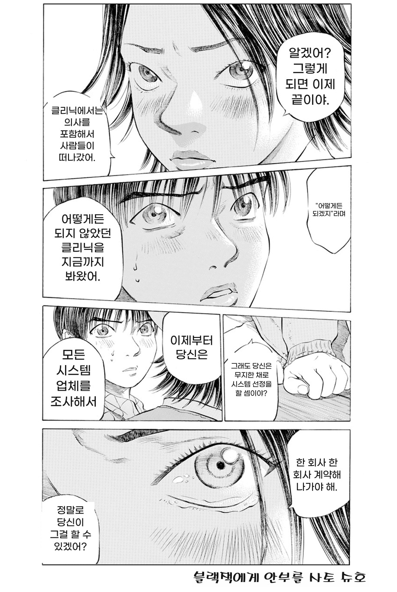
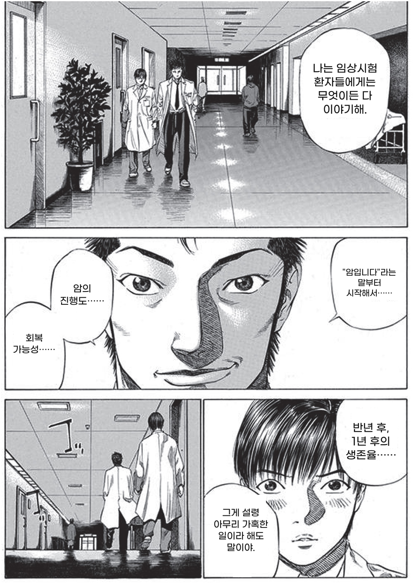
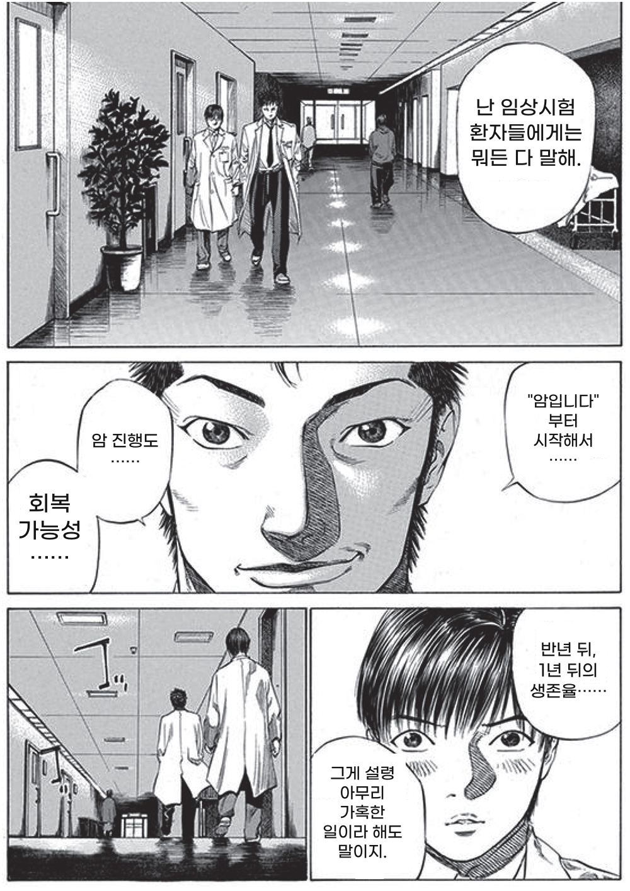
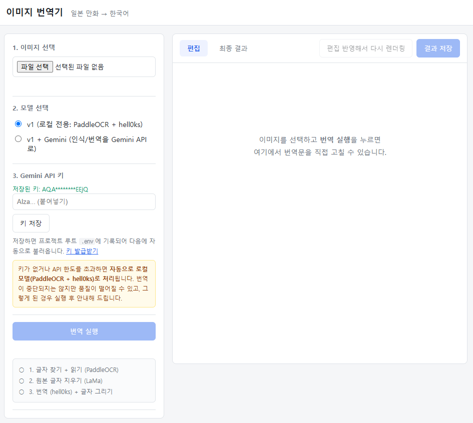

# image-translator

**만화를 일본어에서 한국어로 번역하는 프로젝트입니다.**

## Demo

| 원본 | 번역 결과 |
|---|---|
|  |  |

원본 이미지에서 글자를 찾아 읽고, 번역하고, 원본 글자를 지운 자리에 번역문을 자연스럽게 그려 넣습니다.

|번역 결과 | 수정 결과 |
|---|---|
|  |  | 

말풍선 위치나 폰트 크기가 맘에 들지 않을 경우, 직접 수정할 수 있습니다.


> 개인 학습용 프로젝트입니다. 번역 대상 이미지의 저작권은 사용자 본인이 확인해야 합니다.


## How It Works

<!-- TODO: 파이프라인 다이어그램 -->

파이프라인은 네 단계로 구성됩니다.

| 단계 | 하는 일 | 사용 모델 |
|---|---|---|
| **Detection** | 글자 영역 검출 + 말풍선 검출 → 문단 단위로 묶기 | PP-OCRv5 detection, YOLOv8 말풍선 검출기 |
| **Recognition / Translation** | 일본어 원문을 읽고 한국어로 번역 | PP-OCRv5 파인튜닝 + hell0ks LoRA, **또는** Gemini API |
| **Cleaning** | 원본 글자 지우기 | LaMa (말풍선 밖), 단색 채우기 (말풍선 안) |
| **Rendering** | 번역문을 박스에 맞춰 자동 줄바꿈·크기 조절해 그리기 | Pillow |

### 두 가지 실행 경로

읽고 번역하는 부분인 **Recognition / Translation**의 경우 다른 두 가지 경로가 있습니다.

**`image_translator_v1.py` (로컬 전용)** — PaddleOCR로 읽고 hell0ks 7B + LoRA로 번역합니다. 외부 API가 필요 없지만 GPU가 권장됩니다.

**`image_translator_v1_using_gemini.py` (하이브리드, 권장)** — 글자 **위치 검출**은 로컬 모델을 그대로 쓰고, **읽기와 번역**만 Gemini가 처리합니다.


## Getting Started

### 1. 저장소와 외부 프로젝트

```bash
git clone https://github.com/Victini00/image-translator.git
cd image-translator

git clone https://github.com/PaddlePaddle/PaddleOCR.git external/PaddleOCR
```

### 2. 파이썬 환경

Python 3.10 기준입니다.

```bash
conda create -n image-translator python=3.10
conda activate image-translator
pip install -r requirements.txt
```

`requirements.txt`의 아래 3개는 일반 PyPI 패키지가 아니라 별도 설치가 필요합니다.

- `torch` / `torchvision` — CUDA 빌드(`+cu128`)
- `paddleocr` — GitHub 특정 커밋에서 직접 설치
- `paddlepaddle-gpu` — PaddlePaddle 개발 빌드 wheel

### 3. API 키 (Gemini 경로를 쓸 경우)

프로젝트 루트에 `.env` 파일을 만들고 한 줄 넣습니다. 키는 [Google AI Studio](https://aistudio.google.com)에서 카드 등록 없이 발급받을 수 있습니다.

```
GEMINI_API_KEY=발급받은_키
```

### 4. 모델 준비

| 모델 | 위치 | 받는 방법 |
|---|---|---|
| 일본어 인식 파인튜닝 (v4) | `models/ocr/PP-OCRv5_..._v4/complete_model/` | **저장소에 포함** (약 17MB) |
| PP-OCRv5 detection | `~/.paddlex/official_models/` | 첫 실행 시 자동 |
| 말풍선 검출 (YOLOv8) | HuggingFace 캐시 | 첫 실행 시 자동 |
| LaMa 인페인팅 | `models/inpainting/LaMa/big-lama.pt` | 첫 실행 시 자동 (약 196MB) |
| hell0ks 번역 모델 | HuggingFace 캐시 | 첫 실행 시 자동 (7B) |
| hell0ks LoRA (직접 학습) | `models/translation/.../lora/v1/` | 저장소 미포함 |

`models/` 하위 폴더에 각각 안내 README가 있습니다. 학습 체크포인트 등 무거운 파일은 저장소에서 제외했지만, 폴더 구조는 코드가 기대하는 경로 그대로 유지되어 있습니다.

### 5. 실행

필수 인자는 이미지 경로 하나뿐입니다.

```bash
cd src

# 하이브리드 (권장)
python image_translator_v1_using_gemini.py --img ../data/raw/images/test2.png

# 로컬 전용
python image_translator_v1.py --img ../data/raw/images/test2.png
```

결과는 `output/pipeline_v1_gemini/` (또는 `output/pipeline_v1/`)에 저장됩니다.

| 파일 | 내용 |
|---|---|
| `{이름}_paragraphs.json` | 문단별 좌표·원문·번역문 |
| `{이름}_cleaned.png` | 원본 글자를 지운 이미지 |
| `{이름}_rendered.png` | **최종 결과** |

자주 쓰는 옵션:

```bash
--rec-score-thresh 0.5      # 인식 신뢰도 임계값 (기본 0.4)
--bubble-conf 0.4           # 말풍선 검출 임계값 (기본 0.5)
--max-font-size 40          # 글자 최대 크기 (기본 36)
--gemini-model gemini-3.6-flash
```

각 단계를 따로 실행할 수도 있습니다(`src/models/` 안의 스크립트). 모든 스크립트가 `--help`를 지원합니다.

## Web Editor




```bash
python src/web/app.py       # http://127.0.0.1:5000
```

자동 번역 결과가 항상 완벽할 수는 없습니다. 브라우저에서 결과를 직접 손볼 수 있는
편집 도구를 함께 제공합니다. 수정 후 다시 렌더링할 때는 **번역을 다시 하지 않고**
그리는 단계만 실행하므로 몇 초면 끝납니다.

### 번역문 고치기

말풍선을 **더블클릭**하면 편집창이 열립니다. 편집창은 말풍선을 가리지 않는 위치에
열리고, **타이핑하는 동안 글자가 실시간으로 다시 그려집니다.** 어디서 줄이 바뀌는지
보면서 문장을 다듬을 수 있습니다.

글자 크기는 박스 크기에 맞춰 자동으로 정해지지만, 박스를 선택한 뒤 도구 모음에서
**직접 지정**할 수도 있습니다. 입력란을 비우면 다시 자동으로 돌아갑니다.

### 덧칠해서 지우기

글자 검출이 완벽하지 않아서 원본 글자가 일부 남는 경우가 있습니다. 이럴 때
**덧칠** 모드로 바꾸면 원하는 색으로 직접 칠해서 덮을 수 있습니다.


## Limitations & Roadmap

### 현재 한계

- **세로쓰기 특수문자 오독** — Recognition 모델의 튜닝 부족 문제
- **검출 누락** — 특이한 글꼴, 획이 적은 글자, 후리가나가 조밀한 영역은 검출 단계에서 놓칠 수 있습니다. 웹 편집기의 덧칠 기능으로 보정할 수 있습니다.
- **의존성 라이선스(AGPL)** — 말풍선 검출에 쓰는 Ultralytics가 AGPL-3.0이라, 웹 서비스로 배포하려면 소스 공개 의무가 생길 수 있습니다. 자세한 내용은 [License](#license) 참고.

### 계획

- **인식 모델 재학습** — 두 종류의 데이터셋을 추가할 계획입니다.
  - 실제 만화 스타일의 글꼴과 배치를 반영한 데이터셋 (현재 학습셋은 기본 글꼴 + 흰 배경이라 도메인 차이가 큼)
  - 세로 조판에서 회전되는 특수문자가 반영된 데이터셋
- **웹 서비스화 검토** — 다중 사용자 대응, 글꼴 교체, 배포 환경 구성

## Credits

### 외부 프로젝트

아래 저장소를 `external/` 아래에 clone해서 사용했습니다. 

| 프로젝트 | 저장소 | 사용 커밋 | 용도 |
|---|---|---|---|
| **PaddleOCR** | [PaddlePaddle/PaddleOCR](https://github.com/PaddlePaddle/PaddleOCR) | `8a4dd540e1` | 인식 모델 파인튜닝 학습 코드 |
| **TextRecognitionDataGenerator** | [Victini00/TextRecognitionDataGenerator](https://github.com/Victini00/TextRecognitionDataGenerator) (fork) | `dd9d7d3` | 학습용 합성 이미지 생성. 원본은 [Belval/TextRecognitionDataGenerator](https://github.com/Belval/TextRecognitionDataGenerator) |
| **parseq** | [baudm/parseq](https://github.com/baudm/parseq) | `1902db0` | 인식 모델 후보 검토용. 최종 파이프라인 미사용 |

```bash
git clone https://github.com/PaddlePaddle/PaddleOCR.git external/PaddleOCR
git clone https://github.com/Victini00/TextRecognitionDataGenerator.git external/TextRecognitionDataGenerator
git clone https://github.com/baudm/parseq.git external/parseq
```

### 사용 모델

| 용도 | 모델 |
|---|---|
| 글자 영역 검출 | `PP-OCRv5_server_det` |
| 글자 인식 | `PP-OCRv5_mobile_rec` 일본어 파인튜닝 (직접 학습) |
| 말풍선 검출 | [ogkalu/comic-speech-bubble-detector-yolov8m](https://huggingface.co/ogkalu/comic-speech-bubble-detector-yolov8m) |
| 인페인팅 | [LaMa (big-lama)](https://github.com/advimman/lama) — [Sanster/models](https://github.com/Sanster/models) 배포본 |
| 번역 (로컬) | [hell0ks/ja-ko-vn-7b-v1](https://huggingface.co/hell0ks/ja-ko-vn-7b-v1) + 직접 학습한 LoRA |
| 인식 + 번역 (API) | Google Gemini (`gemini-flash-latest`) |

### 사용 글꼴

- 말풍선 안: Gmarket Sans Medium
- 말풍선 밖: HY피오피M


## License

이 저장소의 코드는 [MIT License](LICENSE)를 따릅니다.

다만 이 프로젝트는 여러 외부 구성요소를 함께 사용합니다. **각 구성요소는 자체
라이선스를 따르므로**, 이 프로젝트를 가져다 쓰실 때는 아래를 함께 확인해 주세요.

| 구성요소 | 라이선스 |
|---|---|
| PaddleOCR / PaddleX / PaddlePaddle | Apache-2.0 |
| 파인튜닝한 일본어 인식 모델 (저장소 포함) | Apache-2.0 (PP-OCRv5 파생) |
| **Ultralytics (YOLOv8)** | **AGPL-3.0** |
| [말풍선 검출 모델](https://huggingface.co/ogkalu/comic-speech-bubble-detector-yolov8m) | Apache-2.0 |
| [LaMa](https://github.com/advimman/lama) | Apache-2.0 |
| [hell0ks/ja-ko-vn-7b-v1](https://huggingface.co/hell0ks/ja-ko-vn-7b-v1) | Apache-2.0 |
| PyTorch / Flask / Pillow / google-genai | BSD-3-Clause / BSD-3-Clause / HPND / Apache-2.0 |

> **말풍선 검출에 쓰는 Ultralytics는 AGPL-3.0입니다.** 이 저장소는 해당 코드를
> 포함하지 않고 설치 시 의존성으로 받지만, AGPL은 네트워크로 서비스를 제공하는
> 경우에도 소스 공개 의무가 발생합니다. **웹 서비스로 배포할 계획이라면** 조건을
> 먼저 확인하거나, 말풍선 검출을 다른 모델로 교체하는 것을 검토하세요.

글꼴은 이 저장소에 포함되어 있지 않고 시스템에 설치된 파일을 참조합니다.
웹 편집기가 미리보기를 위해 글꼴 파일을 브라우저로 전송하므로, 배포 시에는
사용 글꼴의 웹 사용·재배포 라이선스를 확인해야 합니다.
